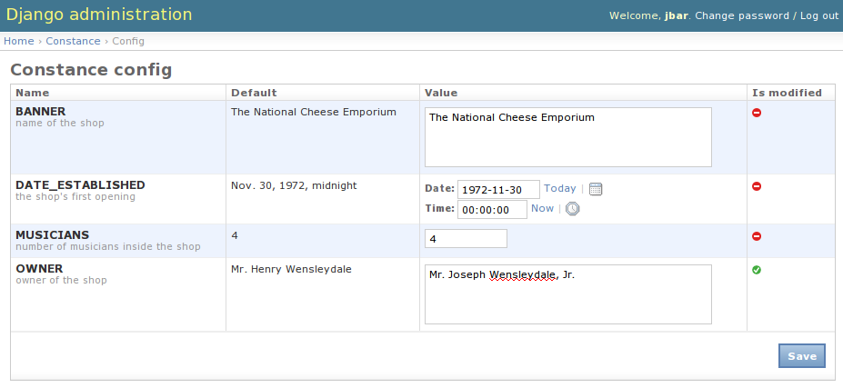

Constance - Dynamic Django settings
===================================

Features
--------

* Easily migrate your static settings to dynamic settings.
* Admin interface to edit the dynamic settings.

Installation
------------

Install from PyPI the backend specific variant of django-constance:

For the (default) Redis backend::

    pip install django-constance[redis]

For the database backend::

    pip install django-constance[database]

Alternatively -- if you're sure that the dependencies are already
installed -- you can also run::

    pip install django-constance

Configuration
-------------

Modify your ``settings.py``. Add ``'constance'`` to your
:setting:`INSTALLED_APPS`, and move each key you want to turn dynamic into
the :setting:`CONSTANCE_CONFIG` section, like this:

.. code-block:: python

    INSTALLED_APPS = (
        ...
        'constance',
    )

    CONSTANCE_CONFIG = {
        'THE_ANSWER': (42, 'Answer to the Ultimate Question of Life, '
                           'The Universe, and Everything'),
    }

Here, ``42`` is the default value for the key ``THE_ANSWER`` if it is
not found in the backend. The other member of the tuple is a help text the
admin will show.

See the :ref:`Backends <backends>` section how to setup the backend and
finish the configuration.

Custom fields
-------------

You can set the field type by the third value in the `CONSTANCE_CONFIG`
tuple. The value can be string or one of the supported types:

.. code-block:: python
        'THE_ANSWER': (42, 'Answer to the Ultimate Question of Life, '
                                   'The Universe, and Everything', str),

If you can add your custom field types, you can use the
`CONSTANCE_ADDITIONAL_FIELDS` variable. Note that you must
use later evaluated strings instead of direct classes:

.. code-block:: python
        CONSTANCE_ADDITIONAL_FIELDS = {
           'yes_no_null_select': ['django.forms.fields.ChoiceField',
              {
              'widget': 'django.forms.Select',
              'choices': (("-----", None), ("yes", "Yes"), ("no", "No"))
              }],
        }

       CONSTANCE_CONFIG = {
           'MY_SELECT_KEY': ('yes', 'select yes or no', 'yes_no_null_select'),
       }

Usage
-----

Constance can be used from your Python code and from your Django templates.

Python
^^^^^^

Accessing the config variables is as easy as importing the config
object and accessing the variables with attribute lookups::

    from constance import config

    # ...

    if config.THE_ANSWER == 42:
        answer_the_question()

Django templates
^^^^^^^^^^^^^^^^

To access the config object from your template you can either
pass the object to the template context:

.. code-block:: python

    from django.shortcuts import render
    from constance import config

    def myview(request):
        return render(request, 'my_template.html', {'config': config})

Or you can use the included config context processor.:

.. code-block:: python

    TEMPLATE_CONTEXT_PROCESSORS = (
        # ...
        'constance.context_processors.config',
    )

This will add the config instance to the context of any template
rendered with a ``RequestContext``.

Then, in your template you can refer to the config values just as
any other variable, e.g.:

.. code-block:: django

    <h1>Welcome on {{ config.SITE_NAME }}</h1>
    
        Woohoo! Head over <a href="/sekrit/">here</a> to use the beta.
    
        Sadly we haven't launched yet, click <a href="/newsletter/">here</a>
        to signup for our newletter.
    

Editing
-------

Fire up your ``admin`` and you should see a new app called ``Constance``
with ``THE_ANSWER`` in the ``Config`` pseudo model.

By default changing the settings via the admin is only allowed for super users.
But in case you want to use the admin's ability to implement custom
authorization checks, feel free to set the :setting:`CONSTANCE_SUPERUSER_ONLY`
setting to ``False`` and give the users or user groups access to the
``constance.change_config`` permission.

.. figure:: screenshot1.png

   The virtual application ``Constance`` among your regular applications.

More documentation
------------------

.. toctree::
   :maxdepth: 2

   backends
   changes

Indices and tables
==================

* :ref:`genindex`
* :ref:`modindex`
* :ref:`search`
