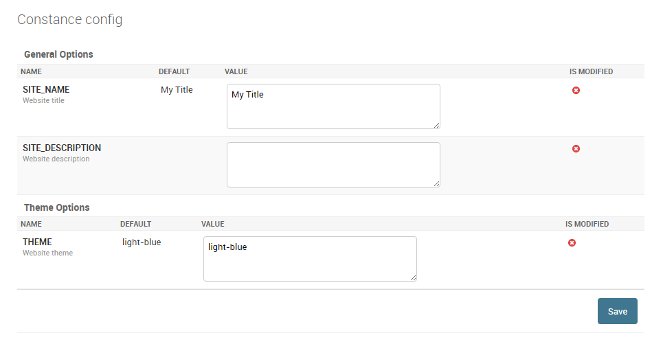
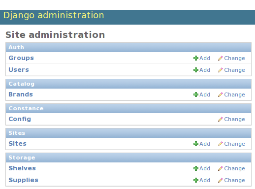

Constance - Dynamic Django settings
===================================

Features
--------

* Easily migrate your static settings to dynamic settings.
* Edit the dynamic settings in the Django admin interface.

Quick Installation
------------------

.. code-block::

    pip install "django-constance[redis]"

For complete installation instructions, including how to install the
database backend, see :ref:`Backends <backends>`.

Configuration
-------------

Modify your ``settings.py``. Add ``'constance'`` to your
:setting:`INSTALLED_APPS`, and move each key you want to turn dynamic into
the :setting:`CONSTANCE_CONFIG` section, like this:

.. code-block:: python

    INSTALLED_APPS = (
        'django.contrib.admin',
        'django.contrib.staticfiles',
        'django.contrib.auth',
        'django.contrib.contenttypes',
        'django.contrib.sessions',
        'django.contrib.messages',
        ...
        'constance',
    )

    CONSTANCE_CONFIG = {
        'THE_ANSWER': (42, 'Answer to the Ultimate Question of Life, '
                           'The Universe, and Everything'),
    }

.. note:: Add constance *before* your project apps.

.. note::  If you use admin extensions like
   `Grapelli <https://grappelliproject.com/>`_, ``'constance'`` should be added
   in :setting:`INSTALLED_APPS` *before* those extensions.

Here, ``42`` is the default value for the key ``THE_ANSWER`` if it is
not found in the backend. The other member of the tuple is a help text the
admin will show.

See the :ref:`Backends <backends>` section how to setup the backend and
finish the configuration.

``django-constance``'s hashes generated in different instances of the same
application may differ, preventing data from being saved.

Use :setting:`CONSTANCE_IGNORE_ADMIN_VERSION_CHECK` in order to skip hash
verification.

.. code-block:: python

    CONSTANCE_IGNORE_ADMIN_VERSION_CHECK = True

Signals
-------

Each time a value is changed it will trigger a ``config_updated`` signal.

.. code-block:: python

    from constance.signals import config_updated

    @receiver(config_updated)
    def constance_updated(sender, key, old_value, new_value, **kwargs):
        print(sender, key, old_value, new_value)

The sender is the ``config`` object, and the ``key`` and ``new_value``
are the changed settings.

Custom fields
-------------

You can set the field type with the third value in the ``CONSTANCE_CONFIG`` tuple.

The value can be one of the supported types or a string matching a key in your :setting:``CONSTANCE_ADDITIONAL_FIELDS``

The supported types are:

* ``bool``
* ``int``
* ``float``
* ``Decimal``
* ``str``
* ``datetime``
* ``date``
* ``time``
* ``list``
* ``dict``

For example, to force a value to be handled as a string:

.. code-block:: python

        'THE_ANSWER': (42, 'Answer to the Ultimate Question of Life, '
                                   'The Universe, and Everything', str),

Custom field types are supported using the dictionary :setting:``CONSTANCE_ADDITIONAL_FIELDS``.

This is a mapping between a field label and a sequence (list or tuple).  The first item in the sequence is the string
path of a field class, and the (optional) second item is a dictionary used to configure the field.

The ``widget`` and ``widget_kwargs`` keys in the field config dictionary can be used to configure the widget used in admin,
the other values will be passed as kwargs to the field's ``__init__()``

Note: Use later evaluated strings instead of direct classes for the field and widget classes:

.. code-block:: python

        CONSTANCE_ADDITIONAL_FIELDS = {
            'yes_no_null_select': ['django.forms.fields.ChoiceField', {
                'widget': 'django.forms.Select',
                'choices': ((None, "-----"), ("yes", "Yes"), ("no", "No"))
            }],
        }

        CONSTANCE_CONFIG = {
            'MY_SELECT_KEY': ('yes', 'select yes or no', 'yes_no_null_select'),
        }

If you want to work with images or files you can use this configuration:

.. code-block:: python

        CONSTANCE_ADDITIONAL_FIELDS = {
            'image_field': ['django.forms.ImageField', {}]
        }

        CONSTANCE_CONFIG = {
            'LOGO_IMAGE': ('default.png', 'Company logo', 'image_field'),
        }

When used in a template you probably need to use:

.. code-block:: html

        

        
        

Images and files are uploaded to ``MEDIA_ROOT`` by default. You can specify a subdirectory of ``MEDIA_ROOT`` to use instead by adding the ``CONSTANCE_FILE_ROOT`` setting. E.g.:

.. code-block:: python

        MEDIA_ROOT = os.path.join(BASE_DIR, 'media')
        CONSTANCE_FILE_ROOT = 'constance'

This will result in files being placed in ``media/constance`` within your ``BASE_DIR``. You can use deeper nesting in this setting (e.g. ``constance/images``) but other relative path components (e.g. ``../``) will be rejected.

Ordered Fields in Django Admin
------------------------------

To sort the fields, you can use an OrderedDict:

.. code-block:: python

        from collections import OrderedDict

        CONSTANCE_CONFIG = OrderedDict([
            ('SITE_NAME', ('My Title', 'Website title')),
            ('SITE_DESCRIPTION', ('', 'Website description')),
            ('THEME', ('light-blue', 'Website theme')),
        ])

Fieldsets
---------

You can define fieldsets to group settings together:

.. code-block:: python

        CONSTANCE_CONFIG = {
            'SITE_NAME': ('My Title', 'Website title'),
            'SITE_DESCRIPTION': ('', 'Website description'),
            'THEME': ('light-blue', 'Website theme'),
        }

        CONSTANCE_CONFIG_FIELDSETS = {
            'General Options': ('SITE_NAME', 'SITE_DESCRIPTION'),
            'Theme Options': ('THEME',),
        }

.. note:: CONSTANCE_CONFIG_FIELDSETS must contain all fields from CONSTANCE_CONFIG.

Fieldsets collapsing
--------------------

To make some fieldsets collapsing you can use new format in CONSTANCE_CONFIG_FIELDSETS. Here's an example:

.. code-block:: python

        CONSTANCE_CONFIG = {
            'SITE_NAME': ('My Title', 'Website title'),
            'SITE_DESCRIPTION': ('', 'Website description'),
            'THEME': ('light-blue', 'Website theme'),
        }

        CONSTANCE_CONFIG_FIELDSETS = {
            'General Options': {
                'fields': ('SITE_NAME', 'SITE_DESCRIPTION'),
                'collapse': True
            },
            'Theme Options': ('THEME',),
        }

Field internationalization
--------------------------

Field description and fieldset headers can be integrated into Django's
internationalization using the ``gettext_lazy`` function. Note that the
``CONSTANCE_CONFIG_FIELDSETS`` must be converted to a tuple instead of dict
as it is not possible to have lazy proxy objects as dictionary keys in the
settings file. Example:

.. code-block:: python

        from django.utils.translation import gettext_lazy as _

        CONSTANCE_CONFIG = {
            'SITE_NAME': ('My Title', _('Website title')),
            'SITE_DESCRIPTION': ('', _('Website description')),
            'THEME': ('light-blue', _('Website theme')),
        }

        CONSTANCE_CONFIG_FIELDSETS = (
            (
                _('General Options'),
                {
                    'fields': ('SITE_NAME', 'SITE_DESCRIPTION'),
                    'collapse': True,
                },
            ),
            (_('Theme Options'), ('THEME',)),
        )

Usage
-----

Constance can be used from your Python code and from your Django templates.

Python
^^^^^^

Accessing the config variables is as easy as importing the config
object and accessing the variables with attribute lookups::

    from constance import config

    # ...

    if config.THE_ANSWER == 42:
        answer_the_question()

Django templates
^^^^^^^^^^^^^^^^

To access the config object from your template you can
pass the object to the template context:

.. code-block:: python

    from django.shortcuts import render
    from constance import config

    def myview(request):
        return render(request, 'my_template.html', {'config': config})

You can also use the included context processor.

Insert ``'constance.context_processors.config'`` at
the top of your ``TEMPLATES['OPTIONS']['context_processors']`` list.  See the
`Django documentation`_ for details.

.. _`Django documentation`: https://docs.djangoproject.com/en/1.11/ref/templates/upgrading/#the-templates-settings

This will add the config instance to the context of any template
rendered with a ``RequestContext``.

Then, in your template you can refer to the config values just as
any other variable, e.g.:

.. code-block:: django

    <h1>Welcome on {{ config.SITE_NAME }}</h1>
    
        Woohoo! Head over <a href="/sekrit/">here</a> to use the beta.
    
        Sadly we haven't launched yet, click <a href="/newsletter/">here</a>
        to signup for our newsletter.
    

Command Line
^^^^^^^^^^^^

Constance settings can be get/set on the command line with the manage command `constance`

Available options are:

list - output all values in a tab-separated format::

    $ ./manage.py constance list
    THE_ANSWER 42
    SITE_NAME  My Title

get KEY - output a single values::

    $ ./manage.py constance get THE_ANSWER
    42

set KEY VALUE - set a single value::

    $ ./manage.py constance set SITE_NAME "Another Title"

If the value contains spaces it should be wrapped in quotes.

.. note::  Set values are validated as per in admin, an error will be raised if validation fails:

E.g., given this config as per the example app::

   CONSTANCE_CONFIG = {
       ...
       'DATE_ESTABLISHED': (date(1972, 11, 30), "the shop's first opening"),
   }

Setting an invalid date will fail as follow::

   $ ./manage.py constance set DATE_ESTABLISHED '1999-12-00'
   CommandError: Enter a valid date.

.. note::  If the admin field is a `MultiValueField`, then the separate field values need to be provided as separate arguments.
E.g., a datetime using `SplitDateTimeField`::

   CONSTANCE_CONFIG = {
       'DATETIME_VALUE': (datetime(2010, 8, 23, 11, 29, 24), 'time of the first commit'),
   }

Then this works (and the quotes are optional)::

   ./manage.py constance set DATETIME_VALUE '2011-09-24' '12:30:25'

This doesn't work::

   ./manage.py constance set DATETIME_VALUE '2011-09-24 12:30:25'
   CommandError: Enter a list of values.

remove_stale_keys - delete all stale records in database::

    $ ./manage.py constance remove_stale_keys

Record is considered stale if it exists in database but absent in config

Editing
-------

Fire up your ``admin`` and you should see a new app called ``Constance``
with ``THE_ANSWER`` in the ``Config`` pseudo model.

By default, changing the settings via the admin is only allowed for superusers.
To change this, feel free to set the :setting:`CONSTANCE_SUPERUSER_ONLY`
setting to ``False`` and give users or user groups access to the
``constance.change_config`` permission.

   The virtual application ``Constance`` among your regular applications.

Custom settings form
--------------------

If you aim at creating a custom settings form this is possible in the following
way: You can inherit from ``ConstanceAdmin`` and set the ``form`` property on
your custom admin to use your custom form. This allows you to define your own
formsets and layouts, similar to defining a custom form on a standard
Django ModelAdmin. This way you can fully style your settings form and group
settings the way you like.

.. code-block:: python

    from constance.admin import ConstanceAdmin, Config
    from constance.forms import ConstanceForm
    class CustomConfigForm(ConstanceForm):
          def __init__(self, *args, **kwargs):
            super().__init__(*args, **kwargs)
            #... do stuff to make your settings form nice ...

    class ConfigAdmin(ConstanceAdmin):
        change_list_form = CustomConfigForm
        change_list_template = 'admin/config/settings.html'

    admin.site.unregister([Config])
    admin.site.register([Config], ConfigAdmin)

You can also override the ``get_changelist_form`` method which is called in
``changelist_view`` to get the actual form used to change the settings. This
allows you to pick a different form according to the user that makes the
request. For example:

.. code-block:: python

    class SuperuserForm(ConstanceForm):
        # Do some stuff here

    class MyConstanceAdmin(ConstanceAdmin):
        def get_changelist_form(self, request):
            if request.user.is_superuser:
              return SuperuserForm:
            else:
              return super().get_changelist_form(request)

Note that the default method returns ``self.change_list_form``.

More documentation
------------------

.. toctree::
   :maxdepth: 2

   backends
   testing
   changes

Indices and tables
==================

* :ref:`genindex`
* :ref:`modindex`
* :ref:`search`
